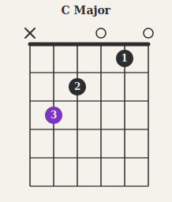
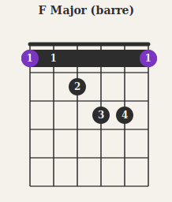
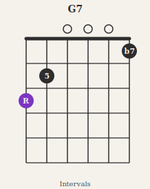
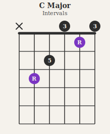
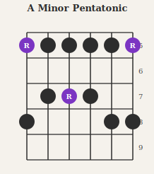
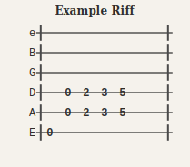
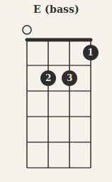

# pelican-fretboard

Pelican plugin that renders fretted instrument diagrams — chord charts, scale boxes, and tab — from fenced code blocks. Diagrams are generated as SVGs, cached on disk, and served as static files. Subsequent builds skip regeneration unless the block content changes.

Styled for the [lizard-spock.co.uk](https://lizard-spock.co.uk) palette by default: warm cream background, charcoal ink lines, sci-fi purple root notes.

---

## Chord diagrams

````markdown
```chord
name: C Major
tuning: EADGBE
frets: [x, 3, 2, 0, 1, 0]
fingers: [-, 3, 2, -, 1, -]
root_strings: [2]
```
````



Barre chords use the `barre` key:

````markdown
```chord
name: F Major (barre)
tuning: EADGBE
frets: [1, 1, 2, 3, 3, 1]
fingers: [1, 1, 2, 3, 4, 1]
root_strings: [1, 6]
barre: {fret: 1, from_string: 1, to_string: 6}
```
````



### Harmony labels

Use `harmony` instead of `fingers` to annotate each note with its interval name. A legend is added automatically.

````markdown
```chord
name: G7
frets: [3, 2, 0, 0, 0, 1]
harmony: [R, 5, 3, R, 5, b7]
```
````



````markdown
```chord
name: C Major
frets: [x, 3, 2, 0, 1, 0]
harmony: [-, R, 5, 3, R, 3]
```
````



Recognised interval abbreviations: `R`, `b2`, `2`, `b3`, `3`, `4`, `b5`, `5`, `b6`, `6`, `b7`, `7`, `8`. Labels are case-insensitive. Strings with `-`, `0`, or blank are not labelled. The legend shows each unique interval in order; pass `legend: false` to suppress it.

When both `harmony` and `fingers` are provided, `harmony` is shown by default. Use `show: fingers` to flip:

````markdown
```chord
name: E Major
frets: [0, 2, 2, 1, 0, 0]
fingers: [-, 2, 3, 1, -, -]
harmony: [R, b7, 3, R, 5, R]
show: fingers
```
````

### Chord keys

| Key | Description | Default |
|-----|-------------|---------|
| `name` | Diagram title | _(none)_ |
| `tuning` | String names low to high | `EADGBE` |
| `strings` | Override string count | length of `tuning` |
| `frets` | Fret per string, low to high. `x` = muted, `0` = open | required |
| `fingers` | Finger number per string. `-` = omit label | _(none)_ |
| `harmony` | Interval label per string (`R`, `3`, `5`, `b7`, etc.). Shown in preference to `fingers` when present | _(none)_ |
| `show` | `harmony` or `fingers` — which labels to render when both are provided | `harmony` if `harmony` present, else `fingers` |
| `legend` | `true`/`false` — show interval legend below the diagram | `true` in harmony mode |
| `root_strings` | 1-indexed string numbers to show in accent colour (fingers mode only) | _(none)_ |
| `start_fret` | First fret shown. `1` draws a nut; higher values show a fret indicator | `1` |
| `barre` | `{fret, from_string, to_string}` — draws a barre bar | _(none)_ |

---

## Scale diagrams

````markdown
```scale
name: A Minor Pentatonic
tuning: EADGBE
start_fret: 5
num_frets: 5
grid:
  - "R . . x ."
  - "x . x . ."
  - "x . R . ."
  - "x . x . ."
  - "x . . x ."
  - "R . . x ."
```
````



The `grid` is one row per string, low to high. Each row is a space-separated sequence of fret values. Column 0 = `start_fret`, column 1 = `start_fret + 1`, and so on.

| Cell value | Meaning |
|------------|---------|
| `R` | Root note — rendered in primary accent colour (purple) |
| `x` or `X` | Scale note — rendered in charcoal |
| `.` or `-` | Not in scale — empty |
| Any other label | Shown as text inside a charcoal dot (e.g. interval names: `b3`, `5`) |

### Scale keys

| Key | Description | Default |
|-----|-------------|---------|
| `name` | Diagram title | _(none)_ |
| `tuning` | String names low to high | `EADGBE` |
| `strings` | Override string count | length of `tuning` |
| `start_fret` | Fret number of the first column | `1` |
| `num_frets` | Width of the box in frets | `6` |

---

## Tab

````markdown
```tab
name: Example Riff
tuning: EADGBe
tab: |
  e|----------------|
  B|----------------|
  G|----------------|
  D|----------------|
  A|----------------|
  E|0--3-5-3--0-----|
```
````



Write standard ASCII tab inside the `tab` block. Each line is `{string label}|{content}`. Barlines (`|`) are rendered as light vertical rules; note numbers are placed on the string lines.

### Tab keys

| Key | Description | Default |
|-----|-------------|---------|
| `name` | Diagram title | _(none)_ |
| `tuning` | String names (used as labels if tab lines omit them) | `EADGBe` |
| `tab` | ASCII tab content (multiline string) | required |

---

## Any fretted instrument

Set `tuning` to match your instrument. The string count is inferred automatically.

````markdown
```chord
name: E (bass)
tuning: EADG
frets: [0, 2, 2, 1]
fingers: [-, 2, 3, 1]
root_strings: [1]
```
````



Examples: `BEADG` (5-string bass), `GCEA` (ukulele), `CGDAE` (mandola), `DADGAD` (open D guitar).

---

## Installation

```bash
pip install -e path/to/pelican-fretboard --config-settings editable_mode=compat
```

Add to `pelicanconf.py`:

```python
PLUGINS = [..., "pelican.plugins.fretboard"]
```

As a git submodule inside your Pelican repo:

```bash
git submodule add https://github.com/morganp/pelican-fretboard plugins/pelican-fretboard
pip install -e plugins/pelican-fretboard --config-settings editable_mode=compat
```

---

## Configuration

All settings are optional. Defaults match the lizard-spock.co.uk palette.

```python
FRETBOARD_CACHE_PATH = "content/images/fretboard"  # where SVGs are written
FRETBOARD_CACHE_URL  = "/images/fretboard"          # URL path served to browsers

FRETBOARD_COLORS = {
    "bg":         "#F5F2EC",  # warm cream background
    "line":       "#2D2D2D",  # charcoal — primary lines and nut
    "line_light": "#4A4A4A",  # lighter charcoal — fret lines, barlines
    "note":       "#2D2D2D",  # regular note dots
    "root":       "#7B35C2",  # sci-fi purple — root notes
    "accent":     "#E07820",  # amber-orange — available for future use
    "dot_text":   "#FFFFFF",  # text inside dots
}
```

Override individual keys to restyle without replacing the whole palette.

---

## How it works

The plugin hooks into Pelican's `content_object_init` signal. It scans rendered article HTML for `<pre><code class="language-chord">` (and `scale`, `tab`) blocks, renders each to an SVG file keyed by a SHA-256 hash of the block content, and replaces the block with a `<figure></figure>` tag. The SVG cache at `FRETBOARD_CACHE_PATH` persists across `make clean` — diagrams are only regenerated when their source content changes.
