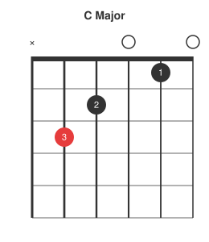
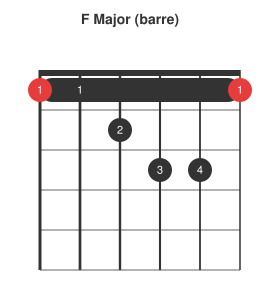
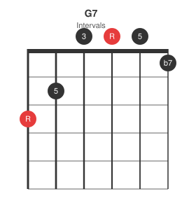
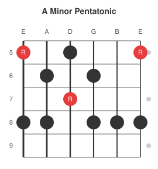
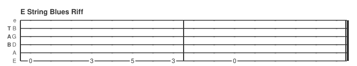
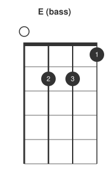

# pelican-fretboard

Pelican plugin that renders fretted instrument diagrams -- chord charts, scale boxes, and tab -- from fenced code blocks. Diagrams are generated as SVGs by the [fretdrom](https://github.com/morganp/fretdrom) CLI, cached on disk, and served as static files. Subsequent builds skip regeneration unless the block content changes.

Syntax is inspired by [WaveDrom](https://github.com/wavedrom/wavedrom): the top-level JSON5 key determines the diagram type.

---

## Chord diagrams

````markdown
```fretdrom
{ chord: { name: "C Major", tuning: "EADGBE", frets: "x32010", fingers: "-32-1-", root_strings: [2] } }
```
````



Fret characters: `x` = muted, `0` = open, `1`-`9` = fret number, `a`-`z` = frets 10-35.
Finger characters: `-` = no label, `1`-`4` = finger number.

Barre chords use the `barre` key:

````markdown
```fretdrom
{ chord: {
  name: "F Major (barre)",
  frets: "112331",
  fingers: "112341",
  root_strings: [1, 6],
  barre: { fret: 1, from_string: 1, to_string: 6 }
}}
```
````



### Interval labels

Use `intervals` to annotate each dot with its harmonic role. When `intervals` is present the subtitle automatically shows *Intervals*.

````markdown
```fretdrom
{ chord: { name: "G7", frets: "320001", intervals: ["R", "5", "3", "R", "5", "b7"] } }
```
````



`intervals` is an array -- one entry per string, low to high. Use `null` or omit entries for unlabelled strings.

Use `subtitle` to show any short annotation below the title instead:

````markdown
```fretdrom
{ chord: { name: "C Major", frets: "x32010", subtitle: "1 - 3 - 5" } }
```
````

### Chord keys

| Key | Description | Default |
|-----|-------------|---------|
| `name` | Diagram title | _(none)_ |
| `subtitle` | Second line below the title. Auto-shows `"Intervals"` when `intervals` is set. `false` suppresses it | _(none)_ |
| `tuning` | String names low to high | `EADGBE` |
| `frets` | Fret per string, low to high (compact string or array) | required |
| `fingers` | Finger number per string (compact string or array, `-`/`null` = omit) | _(none)_ |
| `intervals` | Interval label per string, low to high (array, `null` = omit). Takes priority over `fingers` for dot labels | _(none)_ |
| `root_strings` | 1-indexed string numbers to show in accent colour | _(none)_ |
| `start_fret` | First fret shown. `1` draws a nut; higher values show a fret indicator | `1` |
| `barre` | `{fret, from_string, to_string}` -- draws a barre bar | _(none)_ |

---

## Scale diagrams

````markdown
```fretdrom
{ scale: {
  name: "A Minor Pentatonic",
  tuning: "EADGBE",
  start_fret: 5,
  num_frets: 5,
  grid: [
    ["R", ".", ".", "x", "."],
    ["x", ".", "x", ".", "."],
    ["x", ".", "R", ".", "."],
    ["x", ".", "x", ".", "."],
    ["x", ".", ".", "x", "."],
    ["R", ".", ".", "x", "."]
  ]
}}
```
````



`grid` is an array of rows, one per string, low to high. Each row is an array of cell values.

| Cell value | Meaning |
|------------|---------|
| `"R"` or `"r"` | Root note -- accent colour |
| `"x"` or `"X"` | Scale note -- filled dot, no label |
| `"b3"`, `"4"`, `"b7"` etc. | Scale note with interval label inside the dot |
| `"."` or `"-"` | Not in scale -- empty |

### Scale keys

| Key | Description | Default |
|-----|-------------|---------|
| `name` | Diagram title | _(none)_ |
| `subtitle` | Second line below the title | _(none)_ |
| `tuning` | String names low to high | `EADGBE` |
| `start_fret` | Fret number of the first row | `1` |
| `num_frets` | Height of the box in frets | `6` |
| `grid` | Array of rows, one per string | required |

---

## Tab

The `tab` key takes an array of string lanes, highest string first (standard tab order). Each lane has a `name` and a `wave` string where each character is one beat position. `.` is an empty beat; `0`-`9` are fret numbers; `a`-`z` are frets 10-35; `x` is muted.

````markdown
```fretdrom
{ name: "E String Blues Riff",
  tab: [
    { name: "e", wave: "................" },
    { name: "B", wave: "................" },
    { name: "G", wave: "................" },
    { name: "D", wave: "................" },
    { name: "A", wave: "................" },
    { name: "E", wave: "0..3.5.3..0....." }
  ],
  config: { bar: 8 }
}
```
````



`config.bar` draws bar lines every N beats.

### Tab keys

| Key | Description | Default |
|-----|-------------|---------|
| `name` | Diagram title | _(none)_ |
| `tab` | Array of `{name, wave}` lane objects, highest string first | required |
| `config.bar` | Beats per bar -- draws internal bar lines when set | _(none)_ |

---

## Any fretted instrument

Set `tuning` to match your instrument. String count is inferred from the frets or grid length.

````markdown
```fretdrom
{ chord: { name: "E (bass)", tuning: "EADG", frets: "0221", fingers: "-231", root_strings: [1] } }
```
````



Common tunings: `BEADG` (5-string bass), `GCEA` (ukulele), `GDAE` (mandola), `DADGAD` (open D).

---

## Installation

Install the [fretdrom](https://github.com/morganp/fretdrom) CLI:

```bash
npm install -g fretdrom
```

Install the plugin:

```bash
pip install -e path/to/pelican-fretboard --config-settings editable_mode=compat
```

Add to `pelicanconf.py`:

```python
PLUGINS = [..., "pelican.plugins.fretboard"]
```

As a git submodule inside your Pelican repo:

```bash
git submodule add https://github.com/morganp/pelican-fretboard plugins/pelican-fretboard
pip install -e plugins/pelican-fretboard --config-settings editable_mode=compat
```

---

## Configuration

```python
FRETDROM_CLI = "fretdrom"  # path or name of the fretdrom binary
```

SVGs are written to `content/images/fretboard/` and referenced via `{static}/images/fretboard/`. If `fretdrom` is not found the block falls back to a `json5` code block so the build never fails.

---

## How it works

The plugin registers a Markdown preprocessor (priority 27, before `fenced_code` at 25) that finds ` ```fretdrom ``` ` blocks, hashes the content with MD5, and checks `content/images/fretboard/` for a cached SVG. On a cache miss it writes the block content to a temp file and invokes `fretdrom -i <file>`, capturing the SVG from stdout. The fenced block is replaced with a Markdown image reference. The SVG cache persists across `make clean` -- diagrams are only regenerated when their source content changes.
